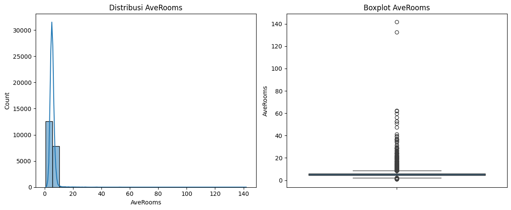
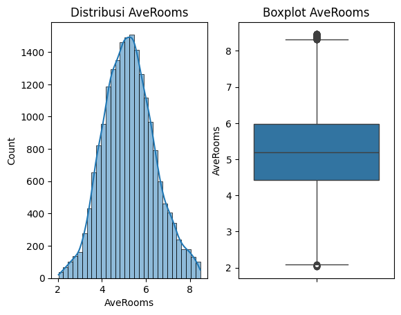

<!-- Banner / Header -->

  

<h1 align="center">📊 Multi-Dataset Exploratory Data Analysis — Customer, Company & Housing Insights</h1>

A comprehensive EDA and preprocessing project using Telco Customer Churn, Company Profile, and California Housing datasets.

---

## 🚀 Project Overview  
This project performs exploratory data analysis (EDA), data cleaning, and feature preprocessing across **three real-world datasets**:

- **Telco Customer Churn** — customer behavior & churn indicators  
- **Company Dataset** — business characteristics & organizational data  
- **California Housing** — residential and population-based housing variables  

The analysis covers:  
- Distribution analysis  
- Looping histograms & boxplots  
- Missing value inspection  
- Outlier detection & IQR handling  
- Categorical encoding  
- Before–after comparison for outlier treatment  
- Business & domain-driven insights  

---

## 🧰 Tech Stack & Libraries  

  
  
  
  
  
  

---

# 📁 Dataset Overview

## 1️⃣ Telco Customer Churn Dataset  
**Purpose:** Understanding factors influencing customer churn.

**Contains:**  
- Demographics  
- Subscription details  
- Billing features  
- Service usage  
- Churn label  

**Preprocessing Steps:**  
- Convert `TotalCharges` to numeric  
- Handle missing values  
- IQR-based outlier handling (billing columns)  
- Encode categorical variables  

---

## 2️⃣ Company Dataset  
**Purpose:** Analyzing company characteristics and business-level metrics.

**Contains:**  
- Industry  
- Number of employees  
- Revenue  
- Headquarters  
- Founded year  

**Preprocessing Steps:**  
- Investigate and impute missing values  
- Outlier detection (revenue, employees)  
- Encode high-cardinality categorical variables  

---

## 3️⃣ California Housing Dataset  
**Purpose:** Exploring housing characteristics and regional population patterns.

**Contains:**  
- Average rooms & bedrooms  
- Population  
- Median income  
- Median house value  
- Geographical coordinates  

**Preprocessing Steps:**  
- Looping distribution plots  
- IQR-based outlier handling  
- Skewness analysis  
- Missing value inspection  

---

# 📊 Before & After Outlier Handling — AveRooms (California Housing)

## 🔵 Before Outlier Treatment  
Place images inside `/images/`:

  

### 🔍 Insights (Before)
- Strong **right-skewed** distribution  
- Extreme outliers (some values >130 rooms)  
- Does not represent realistic housing conditions  
- Requires IQR filtering for clean modeling  

---

## 🟢 After Outlier Treatment (IQR Method)

  

### 🔍 Insights (After)
- Extreme outliers successfully removed  
- Distribution becomes more **balanced and realistic**  
- Majority of homes fall between **4–6 rooms**  
- Boxplot appears cleaner with more reasonable spread  
- Data becomes suitable for modeling and interpretation  

---

# 📉 Outlier Handling — IQR Method

Steps applied for each numeric feature:
1. Compute Q1, Q3  
2. Calculate IQR (Q3 − Q1)  
3. Determine upper & lower bounds  
4. Remove or cap extreme values  
5. Re-visualize distributions  
6. Compare before vs after  

---

# 🔍 Missing Value Handling

Performed across all datasets:
- Missing percentage calculated per column  
- Identify pattern: MCAR, MAR, or MNAR  
- Apply appropriate imputation:
  - **Median** for numerical features  
  - **Mode** for categorical features  
- For high-missing columns:
  - Impute `"Unknown"`, or  
  - Drop column if irrelevant and uninformative  

Example:  
`headquarters` in Company dataset imputed using mode and flagged.

---

# 🧩 Encoding Techniques Applied

| Encoding Method | Use Case |
|-----------------|----------|
| **Label Encoding** | Ordinal categorical variables |
| **One Hot Encoding** | Non-ordinal categorical features |
| **Mean Encoding** | High-cardinality categories (e.g., Industry) |

---

# 🧪 How to Reproduce

1. Clone this repository  
2. Place all datasets in the `/data/` directory  
3. Open the notebook in Google Colab or Jupyter Notebook  
4. Install required dependencies  
5. Run each cell sequentially  
6. Export generated plots into the `/images/` folder  

---

# 🙌 Acknowledgements  
This project is part of a data analysis and preprocessing learning journey, focusing on multi-dataset EDA, outlier handling, and exploratory insights across different domains.

